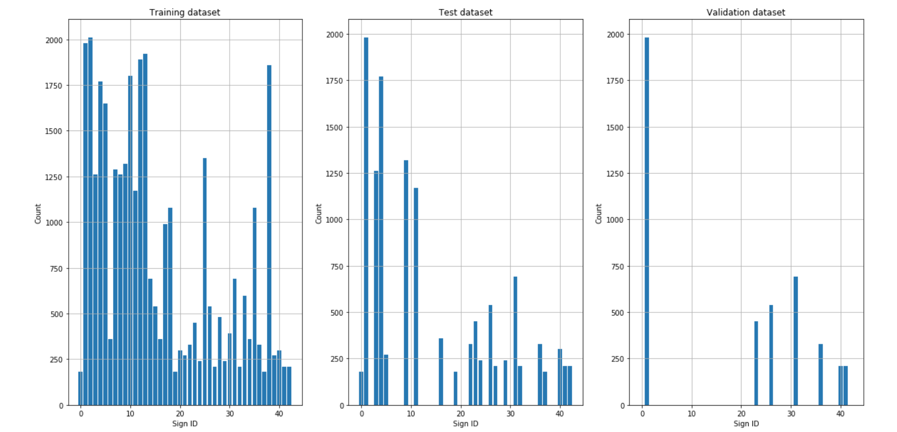
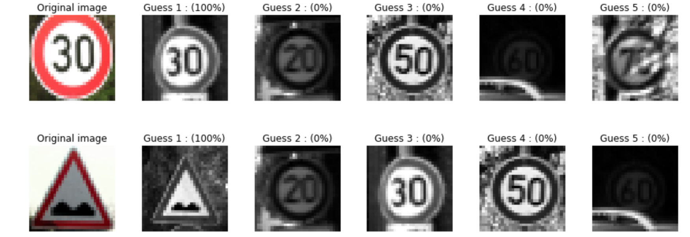
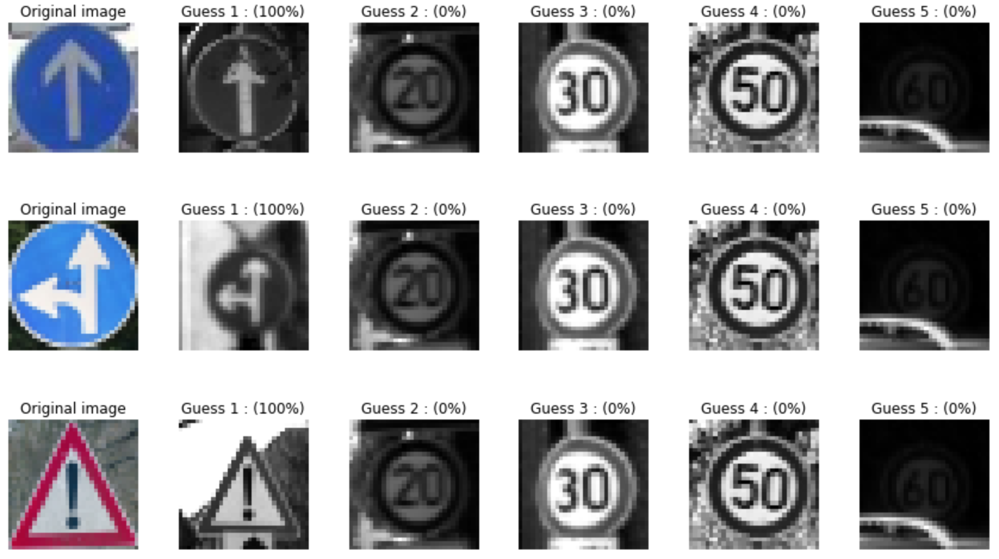

# CarND Traffic Sign Recognition

---

This repo contains my solution to the Traffic Sign Recognition Project for Udacity's Self-Driving Car Engineer Nanodegree Program.

---

**Build a Traffic Sign Recognition Project using Deep Learning**

The goals / steps of this project are the following:
* Load the data set (see below for links to the project data set)
* Explore, summarize and visualize the data set
* Design, train and test a model architecture
* Use the model to make predictions on new images
* Analyze the softmax probabilities of the new images

---

## Data Set Summary & Exploration

### 1. Summary of the dataset

I used the pandas library to calculate summary statistics of the traffic
signs data set:

* The size of training set is 34799
* The size of the validation set is 4410
* The size of test set is 12630
* The shape of a traffic sign image is 32x32x3
* The number of unique classes/labels in the data set is 43

### 2. Exploratory visualization of the dataset

Here is an exploratory visualization of the dataset. The bar chart below shows how many images of each class are included in the training, validation and test dataset:

Images related to the classes are provided [here](./write_up_images/dataset_img1.png) and [here](./write_up_images/dataset_img2.png).

## Design and Test of Model Architecture

### 1. Data preprocessing

The code for this step is contained in the 4th code cell of the IPython notebook located in "./Traffic_Sign_Classifier.ipynb".

Given the fact that the input shape of the network architecture used in this project is 32x32x1, the images are converted into grayscale images. After that the images are normalized. 

Here is an example of traffic sign images before and after the preprocessing step.

### 2. Model architecture

The model architecture is defined in the code cell 5 of the IPython notebook located in "./Traffic_Sign_Classifier.ipynb".

In this project I implemented the [LeNet-5](http://yann.lecun.com/exdb/lenet/) neural network architecture with a few modifications. 

The images of the traffic signs and the images of the MNIST dataset (handwritten digits) show a similar complexity (especially after converting the sign images into grayscale images). The LeNet neural network architecture was chosen because it has been proven that this model architecture is able to classify the handwritten digits very well.

The modified network architecture is the following:

**Input: Grayscale image** Input shape: 32x32x1 

**Layer 1: Convolutional.** Output shape: 28x28x6.

**Activation:** ReLU (Rectified Linear Units)

**Pooling:** Input shape: 28x28x6. Output shape: 14x14x6.

**Layer 2: Convolutional.** Input shape: 14x14x6. Output shape: 10x10x16.

**Activation.** ReLU (Rectified Linear Units)

**Pooling:** Input shape: 10x10x16. Output shape: 5x5x16.

**Flatten:** Flatten the output shape of the final pooling layer such that it's 1D instead of 3D by using `tf.contrib.layers.flatten`. Input shape: 5x5x16. Number of outputs: 400

**Layer 3: Fully Connected.** Number of inputs: 400. Number of outputs: 120. 

**Activation:** ReLU (Rectified Linear Units)

**Dropout:** Dropout with 50% dropout probability during training

**Layer 4: Fully Connected.** Number of inputs: 120. Number of outputs: 84. 

**Activation:** ReLU (Rectified Linear Units)

**Dropout:** Dropout with 50% dropout probability during training

**Layer 5: Fully Connected (Logits).** Number of inputs: 84. Number of outputs: 43. 
 

### 3. Training the model

The code for this step is contained in the code cells 6 to 13 of the IPython notebook located in "./Traffic_Sign_Classifier.ipynb".

To train the model, I used an Adam Optimizer. The hyperparameter used to train the model are set to the following values:

| Hyperparameter		|     Value	        	| 
|:---------------------:|:---------------------:|
| Number of epochs      | 27   					| 
| Batch size     		| 156 					|
| Learning rate			| 0.001					|
| Dropout probability	| 50%			 		|

### 4. Validation

In order to find the optimal values for the hyperparameters, various numbers of hyperparameter sets were chosen to train the model. The resulting models were evaluated with the validation dataset during the training process (after each epoch) and with the test dataset after the training process. 

My final model results were:
* training set accuracy of 0.995
* validation set accuracy of 0.955
* test set accuracy of 0.938

The final results of the model provide enough evidence that the final model is able to classify traffic signs with sufficient accuracy.
 

## Testing the Model on New Images

In order to take the model evaluation one step further, five German traffic signs where choosen and classified using the final model.

The code for this step is contained in the code cells 14 to 17 of the IPython notebook located in "./Traffic_Sign_Classifier.ipynb".

### 1. Choosen German traffic signs.

Here are the five German traffic signs:

### 2. Model predictions

Here are the results of the prediction:

| Image			        |     Prediction	        					| 
|:---------------------:|:---------------------------------------------:| 
| Speedlimit (30km/h)   | Speedlimit (30km/h)   						| 
| Bumpy road     		| Bumpy road 									|
| Ahead only			| Ahead only									|
| Go straight or left	| Go straight or left					 		|
| General caution	    | General caution      							|

The model was able to correctly guess 5 of the 5 traffic signs, which gives an accuracy of 100%. 

### 3. Prediction certainty 

For all the images, the probability of each prediction is 100%.
The top five soft max probabilities for each prediction are displayed below:

